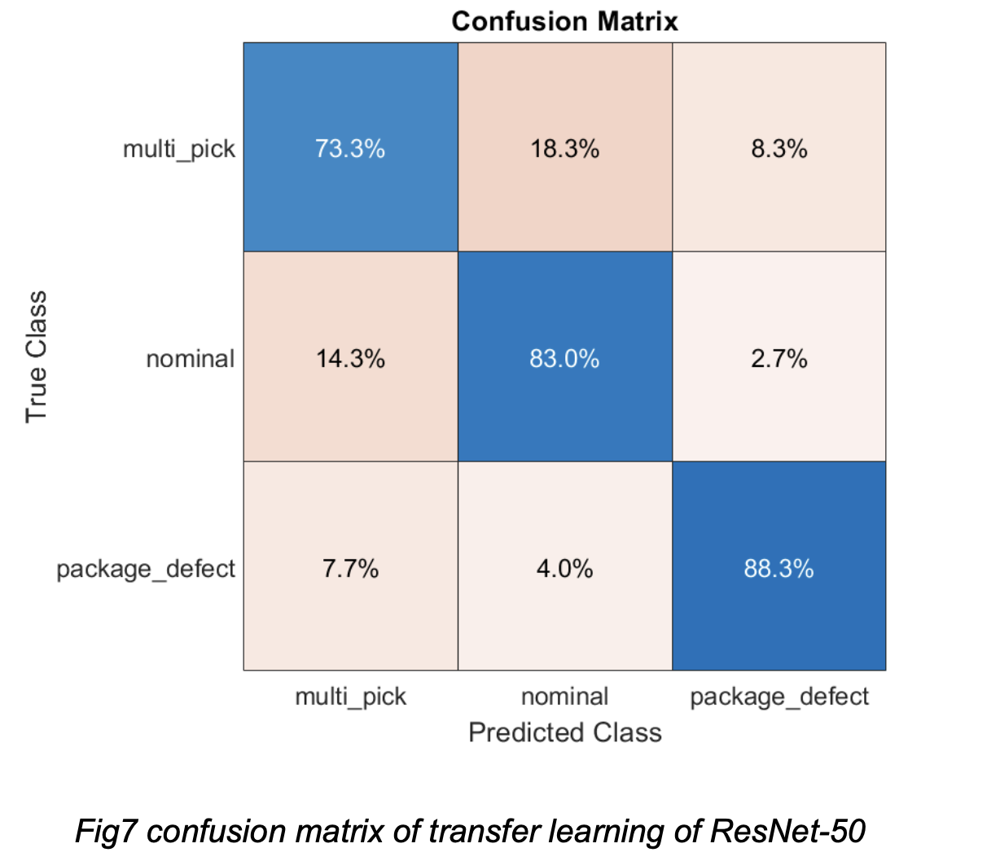

# Package Image Classification for Automated Pickup Verification

## Overview
This project addresses **visual classification of robotic package pickup outcomes** using computer vision and machine learning.  
Based on RGB images from the **ARMBench dataset**, the system classifies pickup attempts into success and failure categories, enabling automated verification for robotic manipulation and delivery systems.

The project compares a **deep learning transfer learning approach (ResNet-50)** with a **feature-based machine learning baseline (XGBoost)**, focusing on performance, robustness, and practical deployment considerations under limited data conditions.

---

## Motivation
In automated delivery and warehouse robotics, incorrect package pickup can result in:
- Failed deliveries  
- Package damage  
- Increased operational cost  

Visual verification using image classification provides a **low-cost perception layer** that can be integrated into robotic pipelines to detect pickup failures and improve system reliability.

---

## Dataset: ARMBench
This project uses the **ARMBench dataset**, a benchmark dataset designed for evaluating robotic manipulation and pickup performance under realistic conditions.

### Pickup Outcome Classes

- **Normal Pickup** – a single, undamaged item is correctly picked  

  

- **Damaged Package** – visible damage on the package  

  

- **Multiple Items Picked** – more than one item is picked unintentionally  

  

The dataset reflects real-world challenges such as clutter, partial occlusion, and subtle visual defects.

> ⚠️ The full ARMBench dataset is not included in this repository due to size constraints.

---

## Methodology

### Image Preprocessing
- Image resizing and normalisation  
- Dataset organisation for supervised learning  
- Feature preparation for downstream models  

---

### Models

Two complementary approaches were evaluated:

- **ResNet-50 (Transfer Learning)**  
  A pretrained deep convolutional neural network fine-tuned for pickup outcome classification.
  This model serves as the **primary model** due to its strong feature representation and robustness.

- **XGBoost Classifier**  
  A feature-based machine learning baseline trained on CNN-extracted features,
  providing a lightweight and interpretable comparison.

---

## Evaluation
Model performance was analysed using a **confusion matrix** to better understand class-level behaviour beyond overall accuracy.

  

Key observations:
- Most misclassifications occur between **Normal Pickup** and **Damaged Package**, where visual differences can be subtle.
- **Multiple Items Picked** is classified more reliably due to stronger geometric and spatial cues.
- Transfer learning with ResNet-50 demonstrates improved robustness compared to the feature-based XGBoost baseline.

---

## Project Structure
.
├── example-image/ # Sample ARMBench images and confusion matrix

├── src/ # Preprocessing, training, evaluation scripts

├── README.md

---

## Results & Insights
- Transfer learning is effective for ARMBench under limited data conditions  
- Feature-based models offer efficiency but reduced expressiveness  
- Error analysis highlights the importance of class-level evaluation in robotic perception tasks  

These results demonstrate practical trade-offs between **model complexity, data availability, and deployment constraints**.

---

## Limitations
- Limited dataset size  
- No real-time inference pipeline  
- MATLAB-centric implementation  

These constraints reflect realistic conditions in early-stage robotic perception systems.

## Technologies
- MATLAB  
- ARMBench Dataset  
- ResNet-50 (Transfer Learning)  
- XGBoost  
- Image Classification & Feature Extraction  

## License
This project is provided for **educational and research purposes**.
