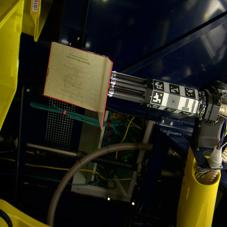
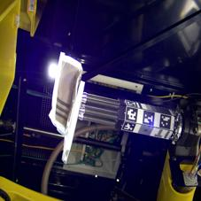

# Delivery Pickup Image Classification

This project implements an **image-based classification system for automated delivery
pickup scenarios**. Camera images captured during the pickup process are analyzed to
determine whether the pickup is **successful**, **damaged**, or **incorrect**.

The system is designed to support delivery automation by detecting pickup failures
such as **package damage** or **accidental multi-item pickup**.

---

## Objective
To train and evaluate image classification models capable of identifying pickup
conditions in delivery systems using camera images captured at the pickup stage.

---

## Classification Categories
> Note: Some images in the dataset may be blurred due to motion or capture conditions.  
> The example images shown below are randomly selected.
> ## Dataset: ARMBench
This project uses the **ARMBench dataset**, a benchmark dataset designed for evaluating robotic manipulation and pickup performance under realistic conditions.

- **Normal Pickup** – a single, undamaged item is correctly picked
  
  
  
- **Damaged Package** – visible damage on the package
  
  
  
- **Multiple Items Picked** – more than one item is picked unintentionally
  
  
  
---

## Approach
- Camera images are preprocessed and resized for model compatibility
- Deep features are extracted using pretrained convolutional neural networks
- Multiple models are evaluated, including:
  - Transfer learning with pretrained CNN feature extraction
  - XGBoost-based classifiers
  - Custom convolutional neural networks
- Models are compared based on classification accuracy and training efficiency

---

## Code Structure
src/

├── main.m # Entry point for training and evaluation

├── extractFeatures.m # CNN-based feature extraction

├── trainXGBoost.m # XGBoost classifier training

├── trainCNN.m # Custom CNN training

├── evaluateModel.m # Model evaluation and metrics

└── utils/

├── preprocessImage.m # Image preprocessing utilities

└── splitDataset.m # Dataset splitting

## How to Run
1. Organize the dataset as follows:

data/

├── normal/

├── damaged/

└── multiple/

3. Run `src/main.m`

---

## Model Architecture and Comparison

### Self-Built CNN Structure

A lightweight custom convolutional neural network was designed and trained from scratch to match the delivery pickup classification task. The network adopts a simple and efficient architecture:

* **Input layer:** RGB images resized to 224 × 224
* **Convolutional layers:** ReLU activation for feature extraction
* **Max pooling layers:** spatial downsampling
* **Fully connected layer:** classification
* **Softmax output layer:** multi-class prediction

This architecture prioritizes **simplicity**, **faster training**, and a **reduced risk of overfitting** when working with a limited dataset.

**Classification accuracy:** approximately **75–76%**

---

### Model Comparison and Advantages

#### Transfer Learning (Pretrained CNN + XGBoost)

Pretrained convolutional neural networks are used to extract high-level visual features, which are then classified using an XGBoost-based model.

* Achieves the **highest classification accuracy**
* Performs well with limited training data
* Suitable when accuracy is the primary objective

**Classification accuracy:** approximately **81–82%**

**Advantages:**

* Strong feature representation
* Faster convergence during training
* Better generalization performance

---

#### Self-Built CNN

The self-built CNN is trained end-to-end on the delivery pickup dataset, making it task-specific and computationally efficient.

**Advantages:**

* Lower computational cost
* Faster training time
* Greater architectural flexibility
* More suitable for embedded or edge deployment

---

### Summary

Transfer learning provides superior accuracy when computational resources are available, while the self-built CNN offers a balanced solution for **real-time delivery systems** where efficiency, simplicity, and deployability are critical.

---
